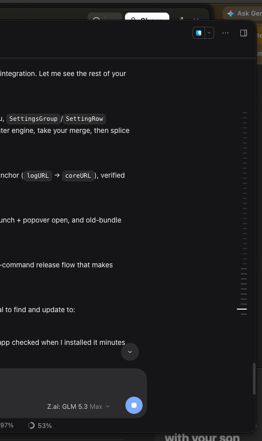

# razerctl

**A native macOS menu-bar app for controlling Razer peripherals — no Synapse, no cloud, no login.**

Razer Synapse weighs in at ~400 MB of resident Electron and wants an account
before it will dim your keyboard. razerctl speaks the devices' USB HID
protocol directly from a ~55 MB native app that lives in your menu bar and
never talks to a server.



## Supported devices

Built for and verified live on:

| Device | Hardware notes |
|---|---|
| Razer Ornata V3 X | single-zone backlight |
| Razer Basilisk V3 | 13 independently addressable RGB zones |

Other Razer devices speaking the same protocol generation likely work with
a small profile addition — see [Development notes](docs/DEVNOTES.md).

## Features

**Basilisk V3**
- DPI: onboard stage switching (400/800/1600/3200/6400) + custom values
- Polling rate: 125 / 500 / 1000 Hz
- Lighting: spectrum, wave, static color, off
- Per-zone rainbow — 11 side-strip zones, each its own color
- Brightness with true read-back
- Free-spin / tactile scroll-wheel mode toggle

**Ornata V3 X**
- Lighting: spectrum, breath, static color, off
- Brightness with read-back

**The app**
- Native SwiftUI panel with per-device sections
- All device I/O on a serial background queue — the UI never blocks
- Self-updating: checks this repo's releases and installs them in one click
  (signature-verified; the macOS privacy grant survives updates)
- Includes the full `razerctl` CLI for scripting

## Install

Requires macOS 12+ (untested below 13).

**From the release** (no build tools needed):

```sh
curl -LO https://github.com/adrianhurtado88/razerctl/releases/latest/download/RazerCtl-v1.1.zip
unzip RazerCtl-v1.1.zip
mv RazerCtl.app /Applications/
xattr -dr com.apple.quarantine RazerCtl.app
open RazerCtl.app
```

**First run — one-time privacy grant:** macOS requires *Input Monitoring*
permission for keyboard control:
System Settings → Privacy & Security → Input Monitoring → **RazerCtl → ON**.
The mouse works without it; the keyboard does not.

**From source** (Rust toolchain + Xcode command-line tools):

```sh
git clone https://github.com/adrianhurtado88/razerctl && cd razerctl
./build-widget.sh
open "${TMPDIR}RazerCtl.app"
```

## CLI reference

The app drives the bundled `razerctl` core; you can drive it yourself:

```text
razerctl info                          firmware + current settings (human)
razerctl status                        same, machine-readable key=value

razerctl dpi <x> [<y>]                  set mouse DPI
razerctl stages <v1,v2,...> [active]   set onboard DPI stages (2-5)
razerctl poll <125|500|1000>           set polling rate (Hz)
razerctl scroll <tactile|free>         scroll-wheel mode

razerctl effect <name> [args]          set a lighting effect
razerctl brightness <0-100>            set lighting brightness
razerctl zones <c1,c2,...>             per-zone static colors (mouse)
razerctl rainbow [n]                   static rainbow over n zones (mouse)
```

Per-device effects (the hardware refuses everything else):

```text
mouse:      spectrum · static <RRGGBB> · wave [left|right] · none
keyboard:   spectrum · static <RRGGBB> · breath · breath-single <RRGGBB> · none
```

Options: `--dev <keyboard|mouse>` targets one device; `--led <all|scroll|logo>`
picks a mouse brightness zone.

## How it works

Razer peripherals expose a control channel as HID feature reports: 90-byte
frames with an XOR checksum, a per-device transaction ID, and a
class/command/arguments layout. The protocol was decoded from the
[OpenRazer](https://github.com/openrazer/openrazer) and
[OpenRGB](https://github.com/CalcProgrammer1/OpenRGB) projects — this
implementation is original, built on [hidapi](https://github.com/libusb/hidapi).

Getting it right on macOS required solving a few undocumented transport
quirks — exact-sized report reads, control-collection whitelisting, a wave
command that rides a different transaction ID — all documented with evidence
in the [Development notes](docs/DEVNOTES.md).

## Troubleshooting

**Keyboard settings do nothing / "not permitted"** — grant Input Monitoring
(see Install). If a rebuild invalidated the grant:
`tccutil reset ListenEvent local.razerctl.widget`, relaunch, re-toggle.

**Building inside an iCloud-synced folder** — app bundles assembled there get
corrupted by sync xattrs; `build-widget.sh` assembles in `$TMPDIR` to avoid
this.

**Device diagnostics** — the app logs every device call to
`/tmp/razerctl-widget.log`; `razerctl probe` and `razerctl brightread`
exercise the transport directly.

## Credits

- [OpenRazer](https://github.com/openrazer/openrazer) and
  [OpenRGB](https://github.com/CalcProgrammer1/OpenRGB) — the protocol
  reverse-engineering this is built on
- [hidapi](https://github.com/libusb/hidapi) — cross-platform HID access

## License

[MIT](LICENSE)
