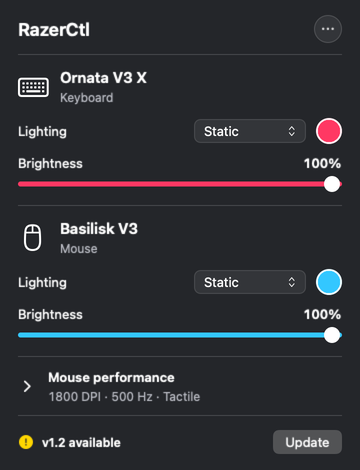

# razerctl

**A native macOS menu-bar app for Razer lighting, mouse settings and custom shortcuts.**

RazerCtl controls supported peripherals directly over USB and selected mice
over Bluetooth, without Synapse or an account. The interface uses SwiftUI
and AppKit, with a Rust core for device commands. Custom assignments are stored locally; the app contacts GitHub to
check for and download updates.



*Native lighting-panel preview from before v1.5, with sample values. Version
1.5 adds product photos and keyboard/mouse customisers.*

## Supported devices

Previously verified USB devices:

| Device | Hardware notes |
|---|---|
| Razer Ornata V3 X | single-zone backlight |
| Razer Basilisk V3 | 13 independently addressable RGB zones |

RazerCtl now detects connected Razer HID products automatically at launch
and when devices are attached or removed. **Detect** in the panel header
retries discovery without restarting the app. Discovery reads settings; it
does not change lighting, DPI, or other device settings.

The feature catalog contains 14 USB product variants across the Ornata V3,
Ornata V3 X, Ornata V3 TKL, Huntsman V2, Huntsman V2 TKL, Basilisk V3,
Viper V2 Pro, and DeathAdder V3 Pro families. The additional profiles are
based on upstream protocol documentation and still need physical-device
verification. Viper V2 Pro and DeathAdder V3 Pro expose DPI and polling
controls, without lighting or motorized-wheel controls.

Controls follow the model's supported commands and successful setting
read-backs. Unrecognized models remain visible with their connection type and an
unsupported-model message. **Detection does not imply universal Razer
customization support**; unknown devices need a verified profile before
configuration commands are enabled.

**Initial Bluetooth support:** the menu-bar app includes a separate native
Bluetooth controller for Basilisk V3 X HyperSpeed and Basilisk V3 Pro. It
implements DPI selection/custom values, brightness and static color, gated
by successful reads, using the documented OpenSnek Bluetooth protocol.
These new paths are covered by automated checks but still need physical-device
verification in RazerCtl. Pair the mouse in macOS Bluetooth settings first,
allow RazerCtl Bluetooth access, and click **Detect**. Other Razer Bluetooth
HID products remain visible without customization controls; Bluetooth keyboard
customization is not implemented. Polling-rate and wheel controls are not
offered over Bluetooth. The Rust CLI remains a USB controller.

See [Device detection](docs/DEVICE-DETECTION.md) for connection details and limits.

Keyboard shortcuts and mouse button assignments work across Mac input devices
while RazerCtl is running, independently of the device control profiles.

## Features

**Basilisk V3**

- DPI: onboard stage switching and custom values from 100 to 26,000
- Polling rate: 125 / 500 / 1000 Hz
- Lighting: spectrum, wave, static color, off
- Per-zone rainbow — 11 side-strip zones, each its own color
- Brightness with true read-back
- Free-spin / tactile scroll-wheel mode toggle

**Ornata V3 X**

- Lighting: spectrum, breath, static color, off
- Brightness with read-back

**The app**

- Automatic device discovery plus a manual Detect button
- Model-specific controls and independent settings for multiple keyboards or mice
- Native SwiftUI panel with per-device sections
- Product photos for known models, with stock device symbols when artwork is unavailable
- Custom keyboard shortcuts: send another shortcut, open an app, or open a website
- Mouse button assignments with recording, individual enable controls and pause
- Device commands run on a serial background queue
- Built-in GitHub release checks and update installation
- Includes the full `razerctl` CLI for scripting

## Install

The v1.5 download is an **Apple silicon** build for **macOS 27 or later**.
Intel builds and builds for older macOS versions are unverified.

### Download the app

1. Open the [latest release](https://github.com/adrianhurtado88/razerctl/releases/latest)
   and download its `RazerCtl-v<version>.zip` asset.
2. Unzip it and move `RazerCtl.app` into **Applications**.
3. Open RazerCtl and click its keyboard icon in the menu bar.

If macOS blocks the app downloaded from this repository, remove the quarantine
flag from that installed copy, then open it:

```sh
xattr -dr com.apple.quarantine /Applications/RazerCtl.app
open /Applications/RazerCtl.app
```

Product photos and the custom keyboard/mouse editors are included starting with
v1.5. Existing installations can choose **Check for Updates…** from the app's
More menu to get the new release.

### Build from source

Requires the Rust toolchain and Xcode command-line tools.

```sh
git clone https://github.com/adrianhurtado88/razerctl.git
cd razerctl
./build-widget.sh
open "${TMPDIR:-/tmp}/RazerCtl.app"
```

The script assembles the app in your temporary directory. Move the built app to
Applications before granting permissions. It uses a Developer ID signing identity
when one is available; otherwise it uses an ad-hoc signature, and permissions may
need to be granted again after a rebuild. Source builds use the toolchain's default
architecture and macOS deployment target.

### Permissions

In **System Settings → Privacy & Security**, enable RazerCtl for the features you
use:

- **Input Monitoring:** keyboard lighting and brightness controls.
- **Bluetooth:** detection and supported controls for paired Bluetooth devices.
- **Accessibility:** custom mouse button assignments and sending keyboard
  shortcuts. The editors provide **Allow Accessibility…** controls; the mouse
  editor also has **Retry**.

Mouse lighting, DPI, polling rate and scroll-mode controls do not require the
keyboard's Input Monitoring grant. Keyboard assignments that open an app or
website do not require Accessibility.

## Custom keyboard shortcuts

Choose **Customise shortcuts…** under the keyboard, or **Keyboard Shortcuts…**
from the app's More menu. Add an assignment, record its trigger, choose an
action, and save. Use a function key such as F6, or a combination containing
Command, Control or Option; ordinary typing keys cannot be captured alone.
F1–F12 may require holding Fn, depending on your Mac's keyboard settings.

Assignments work across **all Mac keyboards while RazerCtl is running**. They
are stored locally on this Mac, not in the Ornata's onboard memory. No key
assignments are created by default. You can disable individual assignments,
pause them all, or delete them; quitting RazerCtl releases its shortcuts.

**Send a shortcut** needs RazerCtl enabled in System Settings → Privacy &
Security → **Accessibility**. Use **Allow Accessibility…** in the editor to
open that setting. Opening an app or website does not need this additional
permission. Sent shortcuts go to the active app after you release the trigger's
modifier keys; changing the active app during that wait cancels the action.

The editor reports reserved system shortcuts and registration conflicts, prevents
duplicate assignments and shortcut loops, and pauses assignments while
recording keys. This version supports shortcuts and actions, not multi-step
macros or per-device firmware remapping.

## Custom mouse buttons

Choose **Customise buttons…** under the mouse, or **Mouse Buttons…** from the
More menu. Add an assignment, choose Middle click or a side button, or use
**Record a mouse button…** to identify an extra button. Choose a keyboard
shortcut, installed app or HTTP(S) website and save. Assignments are saved on
this Mac and apply to **all Mac mice while RazerCtl is running**.

Mouse assignments need **Accessibility** access to replace the original click.
The editor has **Allow Accessibility…** and **Retry** controls. Recording
pauses assigned actions, captures one button, and ends after ten seconds if no
button is detected. An assigned click runs once on release and its original
click is suppressed. Disabling, pausing or deleting an assignment restores
ordinary button behavior; quitting the app removes its mouse handling.

Left and right clicks are preserved. Only middle, side and extra button-click
events exposed by macOS are supported. DPI, scroll-mode and wheel-tilt controls
that do not emit such events need separate hardware support; the app does not
rewrite the mouse's onboard button mappings or pretend to detect these controls.
Use recording to check each physical button rather than assuming its identity
from its position. The existing DPI and scroll-mode settings remain available.

## CLI reference

The app bundles the CLI as `razerctl-core`; installing the app does not add a
`razerctl` command to your shell. For the Applications install above, this optional
alias makes the examples below runnable in the current terminal session:

```sh
alias razerctl='/Applications/RazerCtl.app/Contents/MacOS/razerctl-core'
razerctl list
```

After building from source, you can also use `./target/release/razerctl` directly.

```text
razerctl list                          connected and catalogued devices
razerctl inventory                     Razer HID inventory as JSON (no device I/O)
razerctl detect                        devices, features, settings and errors as JSON
razerctl info                          firmware + current settings (human)
razerctl status                        same, machine-readable key=value

razerctl dpi <x> [<y>]                  set mouse DPI
razerctl stages <v1,v2,...> [active]   set onboard DPI stages (2-5)
razerctl poll <125|500|1000>           set polling rate (Hz)
razerctl scroll <tactile|free>         scroll-wheel mode

razerctl effect <name> [args]          set a lighting effect
razerctl brightness <0-100>            set lighting brightness
razerctl zones <c1,c2,...>             per-zone static colors (mouse)
razerctl rainbow [n]                   static rainbow over n zones (mouse)
```

Use `--id <id>` with an ID from `detect` to target one exact USB device when
several keyboards or mice are connected. The menu-bar app uses these selectors
for USB commands and native Bluetooth UUIDs for Bluetooth commands.

Supported per-device effects:

```text
mouse:      spectrum · static <RRGGBB> · wave [left|right] · none
keyboard:   spectrum · static <RRGGBB> · breath · breath-single <RRGGBB> · none
```

Options: `--dev <keyboard|mouse>` targets one device; `--led <all|scroll|logo>`
picks a mouse brightness zone.

## How it works

Razer peripherals expose a control channel as HID feature reports: 90-byte
frames with an XOR checksum, a per-device transaction ID, and a
class/command/arguments layout. The protocol was decoded from the
[OpenRazer](https://github.com/openrazer/openrazer) and
[OpenRGB](https://github.com/CalcProgrammer1/OpenRGB) projects — this
implementation is original, built on [hidapi](https://github.com/libusb/hidapi).

Getting it right on macOS required solving a few undocumented transport
quirks — exact-sized report reads, control-collection whitelisting, a wave
command that rides a different transaction ID — all documented with evidence
in the [Development notes](docs/DEVNOTES.md).

## Troubleshooting

**Keyboard settings do nothing / "not permitted"** — grant Input Monitoring
(see [Permissions](#permissions)). If a rebuild invalidated the grant:
`tccutil reset ListenEvent local.razerctl.widget`, relaunch, re-toggle.

**Custom shortcuts or mouse assignments do nothing** — check Accessibility,
make sure the assignment is enabled and its editor is not paused, and look for
the error shown in the editor. Choose **Retry** in the mouse editor after changing
its permission. These editors require v1.5 or later.

**Building inside an iCloud-synced folder** — app bundles assembled there get
corrupted by sync xattrs; `build-widget.sh` assembles in `$TMPDIR` to avoid
this.

**Device diagnostics** — the app logs every device call to
`/tmp/razerctl-widget.log`; `razerctl probe` and `razerctl brightread`
exercise the transport directly.

## Credits

- [OpenRazer](https://github.com/openrazer/openrazer) and
  [OpenRGB](https://github.com/CalcProgrammer1/OpenRGB) — the protocol
  reverse-engineering this is built on
- [hidapi](https://github.com/libusb/hidapi) — cross-platform HID access

## License

[MIT](LICENSE)
